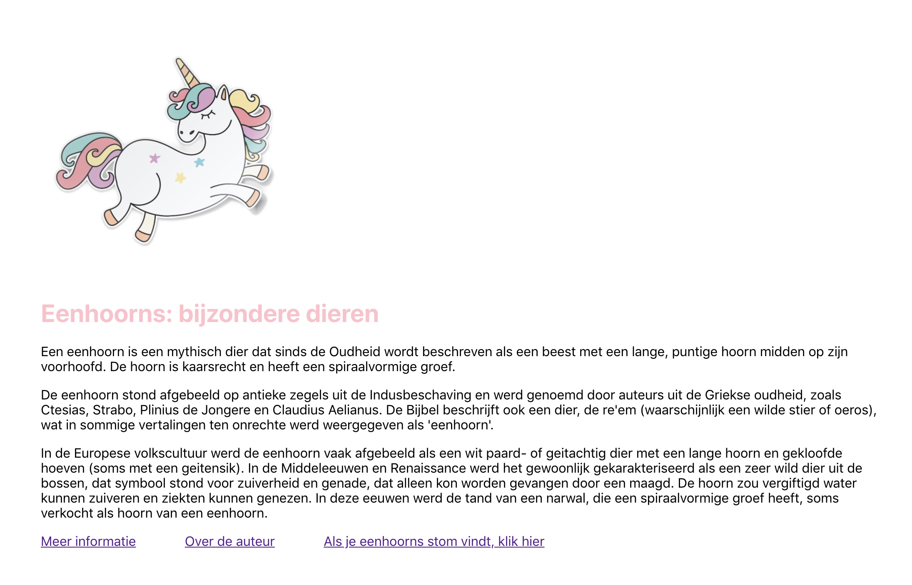

This project was bootstrapped with [Create React App](https://github.com/facebook/create-react-app).

## Available Scripts

In the project directory, you can run:

### `npm install` and `npm start`

Runs the app in the development mode. 
Open [http://localhost:3000](http://localhost:3000) to view it in the browser.

The page will reload if you make edits. 
You will also see any lint errors in the console.

## What the page should look like

## Boilerplate text

Eenhoorns: bijzondere dieren

Een eenhoorn is een mythisch dier dat sinds de Oudheid wordt beschreven als een beest met een lange, puntige hoorn midden op zijn voorhoofd. De hoorn is kaarsrecht en heeft een spiraalvormige groef.

De eenhoorn stond afgebeeld op antieke zegels uit de Indusbeschaving en werd genoemd door auteurs uit de Griekse oudheid, zoals Ctesias, Strabo, Plinius de Jongere en Claudius Aelianus. De Bijbel beschrijft ook een dier, de re'em (waarschijnlijk een wilde stier of oeros), wat in sommige vertalingen ten onrechte werd weergegeven als 'eenhoorn'.

In de Europese volkscultuur werd de eenhoorn vaak afgebeeld als een wit paard- of geitachtig dier met een lange hoorn en gekloofde hoeven (soms met een geitensik). In de Middeleeuwen en Renaissance werd het gewoonlijk gekarakteriseerd als een zeer wild dier uit de bossen, dat symbool stond voor zuiverheid en genade, dat alleen kon worden gevangen door een maagd. De hoorn zou vergiftigd water kunnen zuiveren en ziekten kunnen genezen. In deze eeuwen werd de tand van een narwal, die een spiraalvormige groef heeft, soms verkocht als hoorn van een eenhoorn.

Meer informatie => https://nl.wikipedia.org/wiki/Eenhoorn_(fabeldier)

Over de auteur => jouw linkedin pagina

Als je eenhoorns stom vindt, klik hier => https://nl.wikipedia.org/wiki/Vissen_(dieren)
